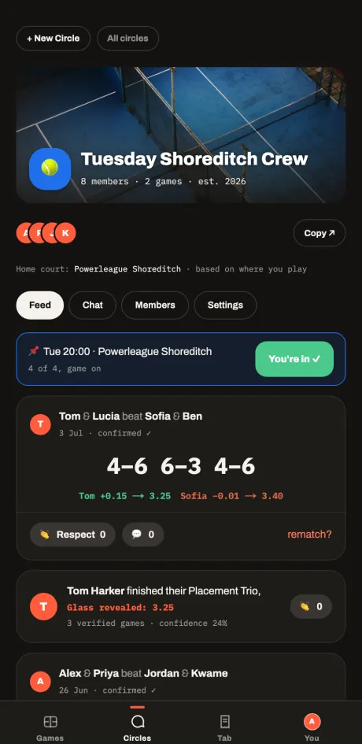
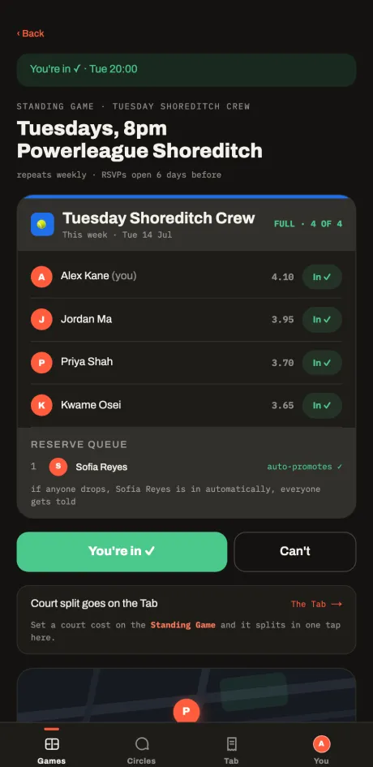
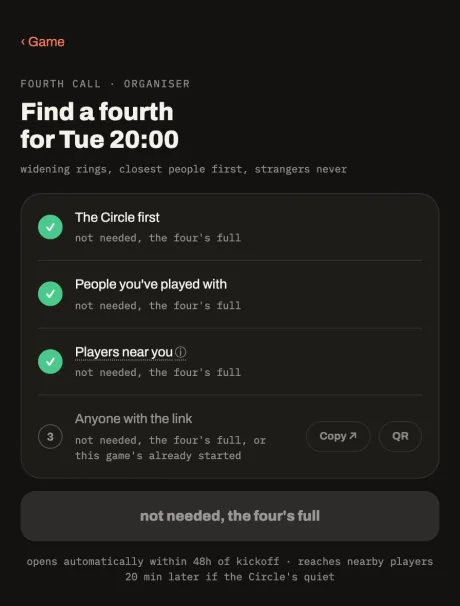

# CUATRO

**The app your padel four runs on.** One short, it finds your fourth. One over, it sorts who sits out.

Built by a padel four in the North East, for padel fours everywhere. CUATRO is free, has no ads, no fees and no dark patterns. It never touches your court money and never holds a penny of it.

Live: **[cuatro.fly.dev](https://cuatro.fly.dev)**

> Status: v1.0 candidate. The core loop (circle, standing game, RSVP, Fourth Call, result, seal, Ledger, Tab) runs end to end and is v1.0-quality for a real group today. A short cut-line of items remains before an external pilot, tracked in [V1-READINESS.md](V1-READINESS.md).

<p>
  
  
  
</p>

## Why it exists

Playtomic got a lot of us into padel and books a court well, but the friction starts with everything around the game: a rating nobody can explain, level anxiety by default, a marketplace of strangers when you just want your usual four, and a group chat where plans go to die. CUATRO fixes the part Playtomic never touched, the organising, and inverts the part it is hated for, the rating.

Full product spec: [docs/DESIGN.md](docs/DESIGN.md). Market research lives at [padel-research.fly.dev](https://padel-research.fly.dev).

## The mechanics

- **Glass, and the Ledger.** A 1.00 to 7.00 rating you can see through. It only moves when you play, and every point of movement is written down in plain English and never edited. You start Unrated and play three games first, so there is no questionnaire and no rounding up. The Ledger is the storage model, not a screen bolted on: it is append-only by design.
- **Circles.** Your group's home screen: members, chat, history, streaks, rivalries. Join by link or QR, no phone numbers exchanged.
- **The Standing Game.** Your weekly fixture runs itself. It opens the RSVP, holds the four, queues the reserves, and promotes the next person in the moment someone drops.
- **The Rotation.** When your crew is bigger than four, the Rotation picks the fairest four: fewest recent games go on first, whoever sat out last week is due, and every pick shows its reason. No racing for a slot, no polite dance.
- **The Fourth Call.** One spot, filled from the inside out through widening rings: your circle, then people you have played with, then players nearby at your level, then anyone with the link. Closest people first, strangers never, unless you choose it.
- **The Board and the Open Door.** Find open games and new groups near you, anchored to a venue and never your live location.
- **Reliability.** Turning up, or not, is part of the record. A simple attendance badge, kept separate from skill. No fines, no debt-locking.
- **The Tab.** Who owes what, in the open. Court split, running balances, and a one-tap nudge to the debtor's own bank app. Money never moves through us.

## Stack

- **Next.js 16** PWA, mobile-first and installable from the browser. The app renders in a 448px centered phone-frame column: it is a phone experience.
- **SQLite on a Fly volume, with Drizzle.** SQLite is the system of record, not a cache. `packages/db` owns the schema and client.
- **The Glass engine** (`packages/glass`) is pure TypeScript with zero runtime dependencies, exhaustively tested including a 10k-match convergence simulation.
- **Supabase** provides auth and realtime only. No application data lives there.
- **Fly.io** for hosting (app `cuatro`, region `lhr`), with the machine kept always-warm.

## Quickstart for contributors

Prerequisites: Node 22, npm, and the [Supabase CLI](https://supabase.com/docs/guides/cli) (for the local auth and realtime stack).

```bash
# 1. Install (npm workspaces, from the repo root)
npm ci

# 2. Start the local Supabase stack (auth + realtime).
#    CUATRO's stack runs on 544xx ports: API 54421, Studio 54423,
#    Mailpit 54424 (all local auth emails land here).
supabase start

# 3. Configure the web app's environment
cp apps/web/.env.example apps/web/.env.local
#    Fill NEXT_PUBLIC_SUPABASE_URL and NEXT_PUBLIC_SUPABASE_ANON_KEY
#    from `supabase status`. DATABASE_PATH defaults to ./dev.db.

# 4. Seed a local database with a sample circle, games and players
DATABASE_PATH=./apps/web/dev.db npm run seed --workspace=@cuatro/db

# 5. Run the dev server (http://localhost:3000)
npm run dev --workspace=@cuatro/web
```

**Signing in without a browser.** Set `AUTH_LEGACY=1` in `apps/web/.env.local`, then `POST /api/auth/request {email}` and grep the dev log for the verify link. This is a dev-only fallback: leave it unset for the normal flow, where magic-link emails land in Mailpit at http://127.0.0.1:54424.

**Checks before you open a pull request.**

```bash
npm test              # full suite (~626 tests, all workspaces); no Supabase stack needed
npm run build         # production build (webpack, not Turbopack)
```

There is no ESLint config: `tsc --noEmit` is the lint bar. Run it for `apps/web` and each package.

## Architecture map

npm-workspaces monorepo:

| Package | What it is |
|---|---|
| `packages/glass` | `@cuatro/glass`: the Glass rating engine. Pure, deterministic, zero runtime deps. Consume its exports, never reimplement its rules. |
| `packages/db` | `@cuatro/db`: Drizzle schema and better-sqlite3 client. SQLite on the Fly volume is the system of record. |
| `apps/web` | `@cuatro/web`: the Next.js 16 PWA. `/` serves the marketing site, `/login` is the auth entry, `/home` is the app. |

Realtime emits fire after the transaction commits and carry minimal signals only; clients refetch through the authed API. Geo discovery is venue-anchored, never device GPS.

## Documentation

- [docs/DESIGN.md](docs/DESIGN.md) — the product spec: named mechanics, economics, scope.
- [CLAUDE.md](CLAUDE.md) — the canonical engineering context: architecture, hard conventions, dev environment, deploy shape.
- [E2E-CHARTER.md](E2E-CHARTER.md) — the functional, realtime and multi-user test bar.
- [V1-READINESS.md](V1-READINESS.md) — honest current state and the cut-line to v1.0.
- [CONTRIBUTING.md](CONTRIBUTING.md) — how to contribute, the conventions reviewers enforce, and the verification bar.

## Contributing

Contributions are welcome. Please read [CONTRIBUTING.md](CONTRIBUTING.md) first: it covers the dev setup, the hard conventions this codebase enforces, the verification bar, and the conventional-commit format that drives releases. By taking part you agree to the [Code of Conduct](CODE_OF_CONDUCT.md). Security issues go through the process in [SECURITY.md](SECURITY.md).

## Licence

MIT. See [LICENSE](LICENSE).
